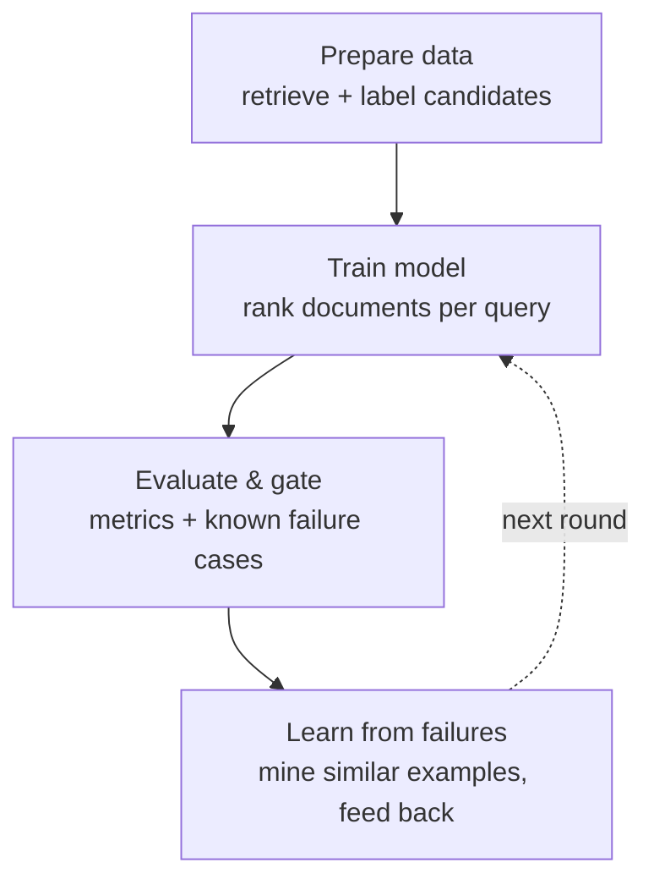

# HeuriBoost

RAG reranking that remembers its mistakes.

[中文 README](./README.zh-CN.md) · [Reference manual](./docs/REFERENCE.md) · [Design specs](./docs/specs/)

## The problem

Your RAG system answers a personal-finance question with a passage about the
wrong situation.

The retriever did not completely fail. It found the right evidence — but it also
found a semantically similar hard negative (same financial topic, wrong
entity/situation) and ranked that misleading passage too high. The generator
then saw plausible-looking evidence that could not support the answer.

Fixing the retriever's embedding model is expensive and risks regressing
everything else. So the mistake quietly comes back next week, in a slightly
different query, and nobody notices until a user does.

## The idea

HeuriBoost is a lightweight reranker that sits after your retriever and **learns
from the specific failures you have already seen** — and, crucially, never
forgets them.

```text
query: "Can I deduct home-office expenses as a sole proprietor?"

retriever output:                          HeuriBoost rerank:
  #1 corporate_office_lease  ✗ hard neg      #1 home_office_deduction  ✓ direct
  #2 standard_deduction      ~ weak          #2 simplified_method      ~ partial
  #3 home_office_deduction   ✓ direct        #4 corporate_office_lease ✗ remembered
```

When it fixes a mistake, it writes that mistake down as a **regression gate**.
Every future reranker must keep the misleading passage out of the protected
top-k, forever. The longer you run it, the more failures it has nailed shut.

That is the whole pitch: a reranker with a memory of its own mistakes, so the
same failure can't reappear twice.

## How it works

Four stages feed into each other. The first three turn data into an evaluated
model; the fourth closes the loop by learning from the model's own mistakes.



| Stage | What happens |
|---|---|
| **Prepare data** | Run retrieval over the corpus (your retriever ships no labels), and grade each query-document pair. |
| **Train model** | Turn each row into features and train an XGBoost ranker, grouped so one query's candidates stay together. |
| **Evaluate & gate** | Score against retriever baselines and replay the known failure cases. A failing **gate** case blocks the run. |
| **Learn from failures** | For failures still open, mine similar examples and feed them back into training. A reliably fixed failure is promoted by hand into a gate. |

The loop in pseudocode:

```text
function run_round(dataset, failure_cases, history):
    train = load(dataset, split="train")

    # optionally attack open failures by mining similar examples
    for case in failure_cases.open:
        train += mine_similar(case, corpus)   # kept separate from the cases

    model = train_ranker(train)

    metrics = evaluate(model)
    results = replay(failure_cases, model)    # a frozen case failing stops here
    history.record(metrics, results)

    suggest_promote(failures_that_now_pass)   # promotion is always manual
    return ok if every frozen case still passes
```

Two rules are absolute, and they are what make the memory trustworthy:

1. **A known failure case is an exam question, never a training row.** Only
   mined samples — deliberately kept separate from the cases — enter training.
2. **Promoting an open failure into a frozen gate is always a human decision.**

## Demo results

The demo uses a real slice of **BEIR/FiQA-2018** (financial QA), where a passage
on the same topic but the wrong entity is semantically close to the query yet
cannot support the answer — exactly the failure HeuriBoost targets.

On the validation split (40 queries), the learned reranker dominates the raw
retriever baselines:

| Ranker | nDCG@10 | MRR@10 | Recall@5 | Hard-neg@3 |
|---|---:|---:|---:|---:|
| **HeuriBoost** | **0.853** | **0.874** | **0.797** | **0.63** |
| dense | 0.329 | 0.403 | 0.318 | 2.33 |
| sparse | 0.232 | 0.297 | 0.208 | 0.13 |
| RRF | 0.281 | 0.337 | 0.261 | 0.95 |

It generalizes to the cold test holdout (nDCG@10 ≈ 0.83), tracking validation
closely — so the gain is not just memorization. Top-3 hard-negative exposure
drops from 2.33 (dense) to 0.63.

> These numbers come from **heuristic labels** (qrel positives plus
> dense-rank-based hard negatives). They illustrate the loop end-to-end; for
> benchmark-grade labels run the builder with `--label-mode llm`. See
> [DATA_CARD](./examples/fiqa/DATA_CARD.md).

## Quick start

```bash
# install runtime deps (on macOS, also: brew install libomp for xgboost)
python -m pip install -r skills/heuriboost-rag/requirements.txt

# validate -> train -> evaluate the committed FiQA demo
python3 skills/heuriboost-rag/scripts/validate_dataset.py examples/fiqa/query_doc_examples.csv
python3 skills/heuriboost-rag/scripts/train_reranker.py  examples/fiqa/query_doc_examples.csv --output-dir examples/fiqa/output
python3 skills/heuriboost-rag/scripts/eval_reranker.py   examples/fiqa/query_doc_examples.csv --output-dir examples/fiqa/output --regression-cases examples/fiqa/regression_cases.yaml
```

Reports land in `examples/fiqa/output/reports/` (gitignored). To bring your own
data, follow the [CSV contract](./docs/REFERENCE.md#csv-contract); for the full
failure-attack loop, ledger, and skill modes see the
[Reference manual](./docs/REFERENCE.md).

## Implementation checklist

Done:

- [x] Standard query-document CSV contract + validator
- [x] Real XGBoost ranking model, grouped by `query_id`
- [x] Retriever + text-signal feature set (overlap, hard-negative, length signals)
- [x] Metrics: nDCG, MRR, recall, hard-negative exposure vs baselines
- [x] Reports: ranking diff, feature importance, deterministic failure analysis
- [x] Regression cases as gates, with a three-state machine (gate / pending / retired)
- [x] Per-case checks (`require_rank`, `min_ndcg10`) + overall-quality check
- [x] Cross-round ledger with a manually-anchored baseline
- [x] `case_sets` mining loop: mine similar failures, fold into training, isolated from cases
- [x] End-to-end FiQA-2018 demo (committed CSV, offline builder, both label modes)
- [x] Codex-compatible agent skill (`audit` / `bootstrap` / `experiment`)

Not yet:

- [ ] LLM-mode (benchmark-grade) labels for the committed demo
- [ ] Feature registry / recipe DSL (features are currently hardcoded)
- [ ] Automatic feature discovery, ablation, and promotion (`FeatureMemory`)
- [ ] HPO adapter to an external backend
- [ ] Other task profiles (classification / regression / …)
- [ ] Online serving, shadow/backtest, A/B rollout
- [ ] Stable Python package / public API (`pyproject.toml`)

The design behind the "Not yet" items lives in [`docs/specs/`](./docs/specs/).

## Concepts

HeuriBoost is an **adaptive XGBoost framework** that learns from labeled
examples and historical failures. The shipped specialization is a RAG
query-document reranker; the same architecture generalizes to classification,
regression, and other supervised tabular tasks.

| Concept | Meaning |
|---|---|
| **TaskProfile** | Binds a task type to its objective, metrics, gates, slices, and serving behavior. The Q-D reranker is one task profile. |
| **LearningExample** | One supervised row. For ranking, rows share a `group_id` (`query_id`). |
| **PredictionContextSnapshot** | The immutable candidate set a model is evaluated against. Comparing models requires the same snapshot. |
| **RegressionCase** | A historical failure expressed as a gate. A gate, never training material. |
| **FeatureRecipe** | A declared, versioned feature (inputs, cost, online-safety, leakage risk). Features live in a registry, not scattered code. |
| **PromotionGate** | The bar a candidate model must clear (global metric, per-case, slice, latency) before replacing the current one. |
| **FeatureMemory** | The record of which features were promoted / rejected / quarantined, and why. |

Full definitions are in
[`docs/specs/ADAPTIVE_XGBOOST_HEURISTIC_SPEC.md`](./docs/specs/ADAPTIVE_XGBOOST_HEURISTIC_SPEC.md).

## Repository layout

```text
.
├── README.md / README.zh-CN.md      project story, concepts, demo
├── docs/
│   ├── REFERENCE.md                  contracts + commands (operational reference)
│   └── specs/                        long-form design specs
├── examples/fiqa/                    the committed FiQA demo + cases + ledger
└── skills/heuriboost-rag/            the Codex skill + runnable scripts + templates
```

There is no `pyproject.toml` yet — run the skill-local scripts directly.
