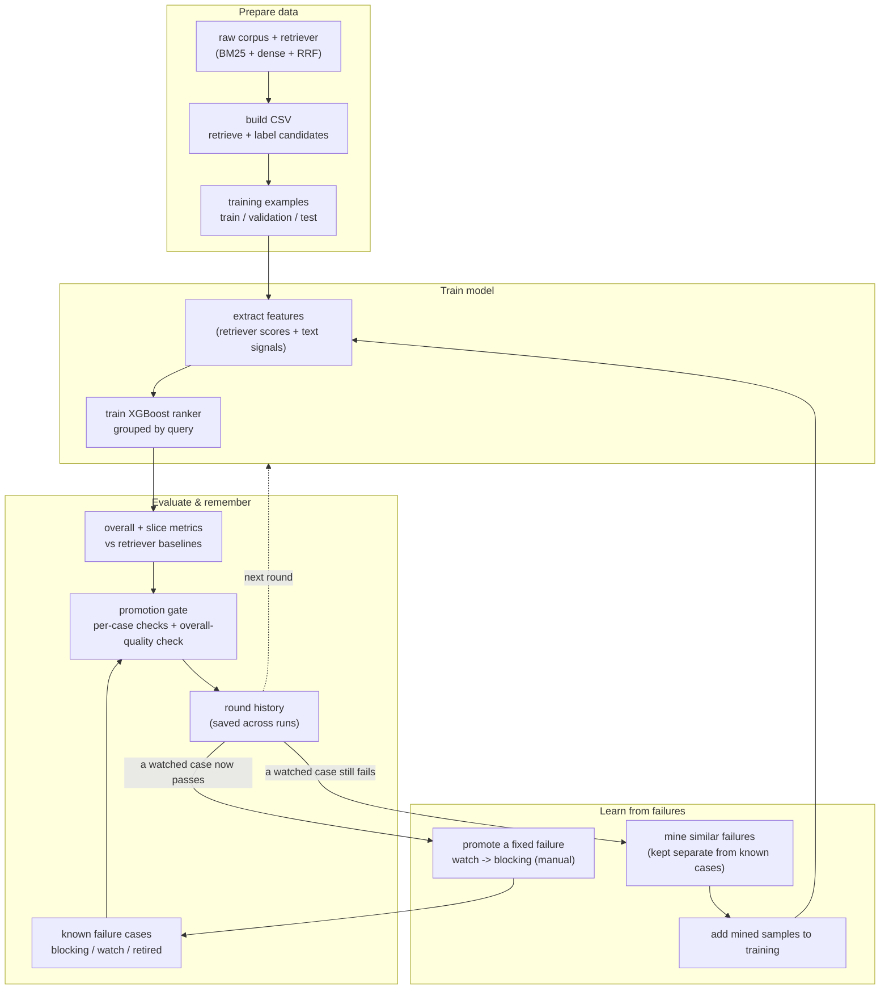

# HeuriBoost

RAG reranking that remembers its mistakes.

[中文 README](./README.zh-CN.md)

Your RAG system answers a personal-finance question with a passage about the
wrong situation.

The retriever did not completely fail. It found the right evidence, but it also
found a semantically similar hard negative — same financial topic, wrong
entity/situation — and ranked that misleading passage too high. The generator
then saw plausible-looking evidence that could not support the answer.

HeuriBoost turns that kind of failure into a reranking upgrade:

```text
query: "Can I deduct home-office expenses as a sole proprietor?"

dense retrieval:
  #1 fiqa_doc_corporate_office_lease   hard negative: same topic, wrong entity
  #2 fiqa_doc_standard_deduction       weak/irrelevant
  #3 fiqa_doc_home_office_deduction    direct evidence

HeuriBoost rerank:
  #1 fiqa_doc_home_office_deduction    direct evidence
  #2 fiqa_doc_simplified_method        partial evidence
  #4 fiqa_doc_corporate_office_lease   remembered hard negative
```

It also writes the mistake down as a regression gate, so the next reranker must
keep the misleading passage out of the protected top-k.

## Concept

HeuriBoost is an **adaptive XGBoost framework** that learns from labeled
examples and historical failures. The repository ships a RAG query-document
reranking specialization (Q-D reranker); the same architecture generalizes to
classification, regression, and other supervised tabular tasks (see
`docs/specs/`).

The core idea is a **failure-driven loop**: the system does not just train a
model — it remembers which failures it has fixed, which are still open, and
which features or parameter changes closed them. A fixed failure becomes a
durable gate; an open failure becomes a target for the next round.

The central abstractions (defined in `docs/specs/ADAPTIVE_XGBOOST_HEURISTIC_SPEC.md`):

- **TaskProfile** — binds a task type (ranking, classification, regression, …)
  to its objective, metrics, gates, slices, and serving behavior. The Q-D
  reranker is one task profile.
- **LearningExample** — one supervised row. For ranking, rows share a
  `group_id` (`query_id`); for classification/regression, rows are individual
  entities.
- **PredictionContextSnapshot** — the immutable candidate set / feature context
  a model is evaluated against. Comparing models requires the same snapshot.
- **RegressionCase** — a historical failure expressed as a gate (expected
  behavior in task-specific terms). A gate, never training material.
- **FeatureRecipe** — a declared, versioned feature with inputs, cost tier,
  online-safety, leakage risk, and expected slices. Features live in a
  registry, not scattered code.
- **PromotionGate** — the multi-dimensional bar a candidate model must clear
  (global metric, per-case, slice, latency, reliability) before replacing the
  current one.
- **FeatureMemory** — the institutional memory of which features were
  promoted / rejected / quarantined, and why.

Two invariants are absolute:

1. **Evaluation snapshots are fixed and splits are hard-isolated** — train,
   validation, regression, and test never share rows in a way that leaks.
2. **Regression cases are exam questions, never training rows** — training on a
   case turns its gate into a rubber stamp and destroys the "remembers its
   mistakes" guarantee. Settlement into training is always via abstracted or
   mined samples, never the case rows themselves.

## Project Flow

HeuriBoost runs as four stages that feed into each other. The first three turn
data into an evaluated model; the fourth closes the loop by learning from the
model's own mistakes and feeding improvements back in. Each stage is described
below the diagram.



### What each stage does

- **Prepare data** — the dataset builder runs retrieval (FiQA ships no
  candidates) and assigns each query-document pair a relevance label (a fast
  heuristic, or an LLM judge). The result is a CSV with fixed train /
  validation / test splits.
- **Train model** — each row is turned into features (retriever scores and
  ranks plus query-document text signals), and an XGBoost ranking model is
  trained, grouped so all candidates for one query stay together.
- **Evaluate & remember** — the model is scored against the raw retriever
  baselines and against a list of known failure cases. The promotion gate runs
  two kinds of check: per-case checks (did this specific failure get fixed?)
  and an overall-quality check (did the model get worse anywhere?). Every run is
  appended to the round history.
- **Learn from failures** — for failures still on the watch list, the system
  mines similar examples from the corpus and adds them to training (these mined
  samples are deliberately kept separate from the known failure cases). When a
  watched failure is reliably fixed, it is promoted by hand to a blocking case
  so future runs can never regress it. Repeating this is the "attack the
  failure set" loop.

### One round, conceptually

```text
function run_round(dataset, failure_cases, history, learn_from_failures):
    # Prepare data + train
    train_rows = load_examples(dataset, split="train")
    if learn_from_failures:
        for case in failure_cases where case is on the watch list:
            similar = mine_similar_failures(case, corpus)
            similar = keep_separate_from(similar, failure_cases)
        train_rows += load_mined_samples()
        assert_no_overlap(train_rows, failure_cases)   # safety re-check
    model = train_xgb_ranker(train_rows, validation_rows)

    # Evaluate + gate
    metrics = evaluate(model, split)
    case_results = run_failure_cases(model, failure_cases)
        # blocking cases stop the run on failure; watched cases only report
    history.record(round, metrics, case_results, learn_from_failures)
    if history.has_baseline:
        report_overall_quality(metrics vs history.baseline)   # reported, not auto-blocking

    # Learn from failures
    for case in watched_cases_that_now_pass(case_results):
        suggest_promote(case)                          # manual, never automatic

    # the demo ships green only if every blocking case passes
    return exit_code == 0 iff no blocking case failed
```

Two rules hold across every round and every stage: (1) the rows of a known
failure case never enter training — only mined samples that are kept separate
from those cases do; (2) promoting a watched failure to a blocking one is always
a manual decision.

## What V0 Does

- Validates a standard query-document CSV contract.
- Trains a real XGBoost ranking model grouped by `query_id`.
- Uses a fixed V0 feature set from retriever scores/ranks and query-document
  text signals: term overlap, number overlap, entity overlap, important-term
  overlap, low-information-density flag, and length features.
- Evaluates nDCG, MRR, recall, and hard-negative exposure.
- Produces ranking diffs, feature importance, regression gate results, and
  deterministic failure analysis lite.
- Ships as a Codex-compatible skill plus runnable local scripts.

## What V0 Does Not Do

V0 does not:

- replace your first-stage retriever
- label your data automatically
- require LangChain, LlamaIndex, or a vector database
- run online A/B tests
- provide a stable Python package or public API
- perform automatic feature discovery, ablation, promotion, or feature memory
- try to become a general AutoML platform

`failure_analysis.md` is deterministic lite analysis, not automatic feature
discovery. It summarizes regression-case metadata, rank movement, expected
evidence hits, and selected V0 feature contrasts.

## Repository Layout

```text
.
├── README.md
├── README.zh-CN.md
├── CODEBUDDY.md
├── docs/
│   └── specs/
│       ├── ADAPTIVE_XGBOOST_HEURISTIC_SPEC.md
│       ├── ADAPTIVE_XGBOOST_HEURISTIC_SPEC_CN.html
│       ├── QD_RERANKER_SPEC.md
│       └── QD_RERANKER_SPEC_CN.html
├── examples/
│   └── fiqa/
│       ├── query_doc_examples.csv
│       ├── regression_cases.yaml
│       ├── ledger.json
│       ├── case_sets/
│       │   ├── manifest.json
│       │   └── <case_id>.csv
│       └── DATA_CARD.md
└── skills/
    └── heuriboost-rag/
        ├── SKILL.md
        ├── requirements.txt
        ├── requirements-build.txt
        ├── scripts/
        │   ├── common.py
        │   ├── inspect_rag_repo.py
        │   ├── validate_dataset.py
        │   ├── train_reranker.py
        │   ├── eval_reranker.py
        │   ├── regression_ledger.py
        │   ├── mine_case_sets.py
        │   └── build_fiqa_csv.py
        └── templates/
            ├── query_doc_examples.csv
            ├── regression_cases.yaml
            ├── feature_recipes.yaml
            └── promotion_gate.yaml
```

There is no `pyproject.toml` in V0. Use the skill-local scripts directly.

## Quick Start

Install dependencies:

```bash
python -m pip install -r skills/heuriboost-rag/requirements.txt
```

On macOS, if `xgboost` cannot load OpenMP, install `libomp`:

```bash
brew install libomp
```

Validate the demo dataset:

```bash
python3 skills/heuriboost-rag/scripts/validate_dataset.py examples/fiqa/query_doc_examples.csv
```

Train the reranker:

```bash
python3 skills/heuriboost-rag/scripts/train_reranker.py examples/fiqa/query_doc_examples.csv --output-dir examples/fiqa/output
```

Evaluate and run regression gates:

```bash
python3 skills/heuriboost-rag/scripts/eval_reranker.py examples/fiqa/query_doc_examples.csv --output-dir examples/fiqa/output --regression-cases examples/fiqa/regression_cases.yaml
```

The eval also appends a round snapshot to the cross-round ledger at
`examples/fiqa/ledger.json` (see [Cross-round ledger](#cross-round-ledger)).
Use `--no-ledger` to skip ledger writes for ad-hoc eval.

Expected outputs:

```text
examples/fiqa/output/
├── models/
│   ├── reranker.json
│   └── reranker_metadata.json
├── reports/
│   ├── eval_report.md
│   ├── ranking_diff.csv
│   ├── failure_cases.md
│   ├── failure_analysis.md
│   ├── failure_analysis.json
│   └── feature_importance.json
└── regression_cases.yaml
```

The generated `output/` directory is ignored by git.

## Regenerating the demo dataset

The committed `examples/fiqa/query_doc_examples.csv` is generated offline from
BEIR/FiQA-2018 by `skills/heuriboost-rag/scripts/build_fiqa_csv.py`. It runs
BM25 + `all-MiniLM-L6-v2` + RRF retrieval (FiQA ships no candidates), then
labels with one of two modes.

Heuristic mode — zero-cost, deterministic, no LLM (this is what produced the
committed CSV):

```bash
python -m pip install -r skills/heuriboost-rag/requirements-build.txt
python skills/heuriboost-rag/scripts/build_fiqa_csv.py \
  --label-mode heuristic --output examples/fiqa/query_doc_examples.csv
```

LLM mode — full 5-level labels via an OpenAI-compatible judge (DeepSeek by
default):

```bash
python -m pip install -r skills/heuriboost-rag/requirements-build.txt
export DEEPSEEK_API_KEY=sk-...   # or OPENAI_API_KEY with --base-url ""
python skills/heuriboost-rag/scripts/build_fiqa_csv.py \
  --label-mode llm --output examples/fiqa/query_doc_examples.csv
```

Both modes need network access (to download FiQA); only LLM mode needs an API
key. The build is run locally by a maintainer, not in CI. Its heavy build
dependencies, the downloaded FiQA corpus, and the dense-encoder weights are not
committed. See `examples/fiqa/DATA_CARD.md` for provenance.

## CSV Contract

Required columns:

```csv
query_id,query_text,doc_id,doc_text,label,split
```

Recommended V0 columns:

```csv
query_id,query_text,doc_id,chunk_id,doc_text,dense_rank,dense_score,sparse_rank,sparse_score,label,split
```

Label scale:

```text
3  directly supports the answer
2  partially supports the answer
1  related but weak evidence
0  irrelevant
-1 misleading hard negative
```

For XGBoost training, labels are mapped to non-negative ordered relevance:

```text
-1 -> 0
 0 -> 1
 1 -> 2
 2 -> 3
 3 -> 4
```

Evaluation keeps the original labels so hard negatives remain visible in reports
and regression gates.

## Regression Cases

Regression cases are exam questions, not training rows. Each case carries a
`status`:

- `gate` — attacked & frozen. A failure blocks (exit non-zero).
- `pending` — a known gap to attack. Evaluated and reported, but failure does
  NOT block (exit 0). These are the cases to attack next.
- `retired` — invalidated by corpus/label drift. Not evaluated; kept for
  history. A case with no `status` defaults to `gate` (backward compatible).

A case may also declare optional per-case local metric checks (the "A" check):

- `require_rank` (int): the first `must_include` doc must reach rank <= this
  value (stricter than just top-k membership).
- `min_ndcg10` (float): the per-query nDCG@10 must be >= this value.

A case "passes" iff all `must_include` are within top_k (and the first reaches
`require_rank` if set) AND no `must_not_include` is within top_k AND
`min_ndcg10` is satisfied if set.

```yaml
cases:
  - case_id: fiqa_expense_deduction_wrong_topic
    query_id: fiqa_q_001
    status: gate
    require_rank: 3
    query: "Can I deduct home-office expenses as a sole proprietor?"
    must_include_doc_ids:
      - fiqa_doc_home_office_deduction
    must_not_include_doc_ids:
      - fiqa_doc_corporate_office_lease
    top_k: 3
    failure_type: semantic_hard_negative
    expected_evidence:
      - "home office"
      - "deduction"
      - "sole proprietor"
```

If a `gate` case fails, `eval_reranker.py` exits non-zero. `pending` failures
are reported but do not change the exit code.

### Cross-round ledger

`regression_ledger.py` owns cross-round memory in a committed
`examples/fiqa/ledger.json` (version-controlled, NOT gitignored, NOT
auto-committed). Each evaluation round appends a snapshot (global metrics,
per-case pass/fail, and a B-vs-anchor comparison). The anchor is a frozen
snapshot's global metrics, manually refreshed when gains are confirmed.

```bash
# After an eval round, set the anchor (manual, one-time or on confirmed gains):
python skills/heuriboost-rag/scripts/regression_ledger.py set-anchor --ledger examples/fiqa/ledger.json

# Print a progress summary (gate/pending counts, promotion candidates, B line):
python skills/heuriboost-rag/scripts/regression_ledger.py summary --ledger examples/fiqa/ledger.json

# Promote a pending case to gate (interactive confirmation, no auto-promotion):
python skills/heuriboost-rag/scripts/regression_ledger.py promote examples/fiqa/regression_cases.yaml <case_id> --ledger examples/fiqa/ledger.json
```

Use `--no-ledger` on `eval_reranker.py` to skip ledger writes for ad-hoc eval.

## Closing the loop: case_sets mining

Pending cases are known gaps to attack. The "textbook path" for attacking one
is to mine same-pattern training samples from the corpus, fold them into train,
and re-evaluate to see if the pending case moves toward passing. The case
itself stays an exam question — only B+C-isolated mined samples enter training.

The four-command closed loop (run by the maintainer; no auto-promotion):

```bash
# 1. Mine same-pattern samples for all pending cases (needs build deps)
python skills/heuriboost-rag/scripts/mine_case_sets.py \
  --dataset examples/fiqa/query_doc_examples.csv \
  --cases examples/fiqa/regression_cases.yaml \
  --out-dir examples/fiqa/case_sets

# 2. Retrain with mined samples folded into the train split
python skills/heuriboost-rag/scripts/train_reranker.py \
  examples/fiqa/query_doc_examples.csv \
  --output-dir examples/fiqa/output \
  --case-sets examples/fiqa/case_sets \
  --regression-cases examples/fiqa/regression_cases.yaml

# 3. Eval + ledger (tags the round as having used case_sets)
python skills/heuriboost-rag/scripts/eval_reranker.py \
  examples/fiqa/query_doc_examples.csv \
  --output-dir examples/fiqa/output \
  --split validation \
  --regression-cases examples/fiqa/regression_cases.yaml \
  --case-sets-used

# 4. (manual) If a pending case passed AND the B check is OK, promote it
python skills/heuriboost-rag/scripts/regression_ledger.py promote \
  examples/fiqa/regression_cases.yaml <case_id> --ledger examples/fiqa/ledger.json
```

Mining rule = a+b+c intersection: semantic similarity to the case's query
(all-MiniLM-L6-v2, top-K), same failure shape (hard negative at
`dense_rank <= --shape-rank`, positive at `dense_rank >= --shape-pos-gap`),
and same `failure_type`. B+C isolation is enforced: no mined `query_id` may
equal any case's `query_id`, and no mined `doc_id` may equal any case's
`must_include`/`must_not_include` doc_id.

`sentence-transformers` is a build dependency
(`requirements-build.txt`), not a runtime dependency. Mining reuses
`examples/fiqa/.cache/query_embeddings.npz` when present.

> **Pipeline-validation caveat**: step-2 attack results under heuristic labels
> are pipeline-validation grade, not benchmark. They test whether the
> closed-loop mechanics work (mine → train → eval → promote), not whether the
> attack credibly moves a pending case. Credible attack quality waits for
> LLM-mode labels (`--label-mode llm` in `build_fiqa_csv.py`).

## Reports

`eval_report.md`
: Global metrics and regression gate status, split into Gates (pass/fail list)
and Pending (pass/fail list with promotion candidates).

`ranking_diff.csv`
: Before/after rank movement using dense rank as the default baseline.

`failure_cases.md`
: Hard-negative exposure report for the top 3.

`failure_analysis.md`
: Deterministic regression-case analysis with reason summary, rank movement,
evidence hits, feature contrast, and suggested next actions.

`feature_importance.json`
: XGBoost gain-based feature importance normalized across the V0 feature list.

## Agent Skill

The Codex-compatible skill lives in:

```text
skills/heuriboost-rag/SKILL.md
```

It exposes three modes:

- `audit`: scan a RAG repo for retriever/eval/log/dataset signals
- `bootstrap`: copy templates and explain the CSV contract
- `experiment`: validate CSV, train, evaluate, and inspect reports

Other coding agents can still run the Python scripts manually, but V0 does not
provide a complete multi-agent installation experience.

## Current Status

Status: V0 prototype.

The demo uses a real slice of BEIR/FiQA-2018 (financial question answering),
where a passage on the same financial topic but the wrong entity/situation is
semantically similar to the query yet cannot support the answer. HeuriBoost
learns to lift the supporting passage and push the misleading hard negative
down. The committed CSV is generated offline (see "Regenerating the demo
dataset" and `examples/fiqa/DATA_CARD.md`).

On this demo (230 queries, 150/40/40 split), the reranker generalizes to the
cold test holdout: nDCG@10 0.83 vs dense 0.35 / sparse 0.25 / RRF 0.32, with
top-3 hard-negative exposure dropping from 2.15 (dense) to 0.48. Validation and
test track closely (nDCG@10 0.85 vs 0.83), so the gain is not just memorization.
These numbers come from heuristic labels (qrel positives plus dense-rank-based
hard negatives), so they illustrate the loop rather than serve as a benchmark;
use `--label-mode llm` for benchmark-grade labels.

Long-form design specs live in `docs/specs/`.
# heuriboost
