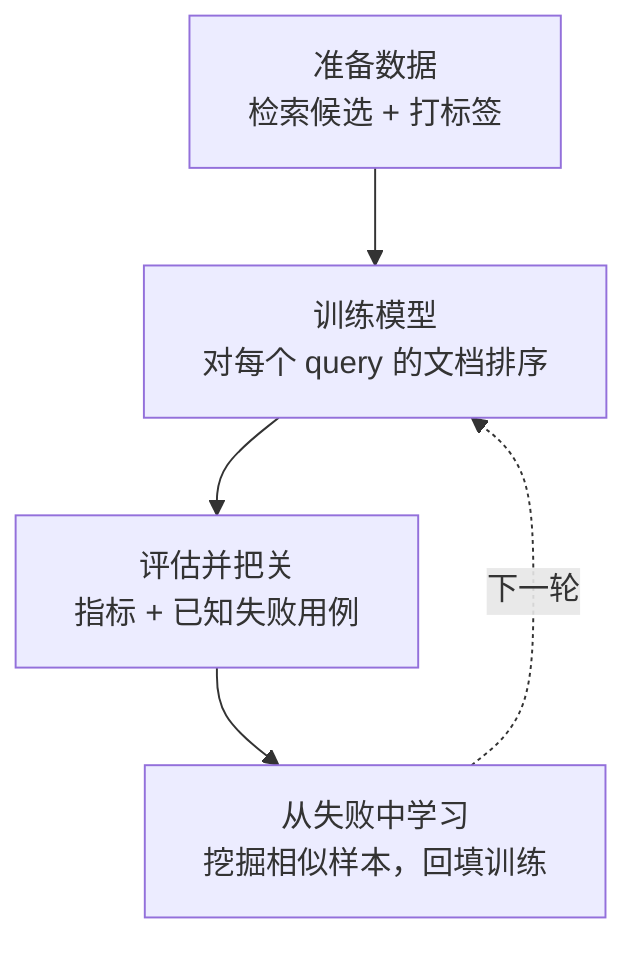
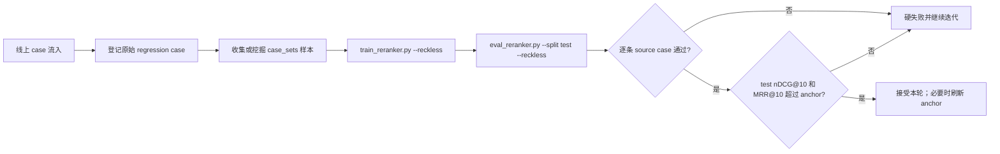

# HeuriBoost

会记住错误的 RAG 重排序。

[English README](./README.md) · [参考手册](./docs/REFERENCE.zh-CN.md) · [设计规格](./docs/specs/)

## 问题

你的 RAG 系统在回答一个个人理财问题时，引用了一段"场景错位"的文档。

这不一定是召回完全失败。retriever 可能已经找到了正确证据，但同时也找到了一个
语义很像的 hard negative（金融主题相同，但实体/情境错误），并把这段误导性文档
排得太高。generator 看到的是"看起来很相关、却不能支撑答案"的证据。

去改 retriever 的 embedding 模型代价高，还可能把别的都拖坏。于是这个错误下周
又悄悄回来——换一个略有不同的 query，没人察觉，直到用户踩到。

## 思路

HeuriBoost 是一个轻量 reranker，接在你的 retriever 之后，**从你已经见过的具体
失败中学习**，而且关键是：永不遗忘。

```text
query: "Can I deduct home-office expenses as a sole proprietor?"

retriever 输出：                            HeuriBoost 重排后：
  #1 corporate_office_lease  ✗ hard neg      #1 home_office_deduction  ✓ 直接
  #2 standard_deduction      ~ 弱            #2 simplified_method      ~ 部分
  #3 home_office_deduction   ✓ 直接          #4 corporate_office_lease ✗ 被记住
```

每修好一个错误，它就把这个错误写成一条 **regression gate**。之后每一版 reranker
都必须永远把这段误导性文档挡在受保护的 top-k 之外。跑得越久，被钉死的失败越多。

整个卖点就是：一个带记忆的 reranker，让同一个失败不会出现第二次。

## 工作原理

四个互相衔接的阶段。前三个把数据变成一个经过评估的模型；第四个从模型自己犯的
错误中学习，闭环。



| 阶段 | 做什么 |
|---|---|
| **准备数据** | 对语料跑检索（你的 retriever 不带标签），给每个 query-document 对打分。 |
| **训练模型** | 把每行转成特征，训练 XGBoost 排序模型，按 query 分组使同一 query 的候选在一起。 |
| **评估并把关** | 与检索器基线对比，并回放已知失败用例。一个 **gate** 用例失败就阻断本轮。 |
| **从失败中学习** | 对仍开放的失败，挖掘相似样本回填训练。被稳定修好的失败由人工晋级为 gate。 |

循环的伪代码：

```text
function run_round(dataset, failure_cases, history):
    train = load(dataset, split="train")

    # 可选：挖掘相似样本来攻击开放的失败
    for case in failure_cases.open:
        train += mine_similar(case, corpus)   # 与用例隔离开

    model = train_ranker(train)

    metrics = evaluate(model)
    results = replay(failure_cases, model)    # 冻结用例失败即终止
    history.record(metrics, results)

    suggest_promote(failures_that_now_pass)   # 晋级永远是手动
    return ok if 每个冻结用例仍通过
```

两条铁律绝对成立，它们正是这份记忆可信的根基：

1. **已知失败用例是考题，永不作为训练行。** 只有与用例隔离开的挖掘样本进入训练。
2. **把开放的失败晋级为冻结 gate 永远是人工决定。**

## Demo 效果

demo 使用 **BEIR/FiQA-2018**（金融问答）的真实切片：一段主题相同、但实体错误的
文档和 query 语义相近，却不能支撑答案——正是 HeuriBoost 针对的失败。

在 validation 划分（40 条 query）上，学习到的 reranker 全面压过原始检索器基线：

| Ranker | nDCG@10 | MRR@10 | Recall@5 | Hard-neg@3 |
|---|---:|---:|---:|---:|
| **HeuriBoost** | **0.853** | **0.874** | **0.797** | **0.63** |
| dense | 0.329 | 0.403 | 0.318 | 2.33 |
| sparse | 0.232 | 0.297 | 0.208 | 0.13 |
| RRF | 0.281 | 0.337 | 0.261 | 0.95 |

它在冷 test holdout 上依然泛化（nDCG@10 ≈ 0.83），与 validation 接近——说明提升
不是单纯记忆。top-3 hard negative 暴露从 dense 的 2.33 降到 0.63。

> 这些数字基于**启发式标签**（qrel 正例 + 基于 dense 排名的 hard negative），用于
> 端到端演示循环；需要 benchmark 级标签请用 `--label-mode llm` 重新生成。见
> [DATA_CARD](./examples/fiqa/DATA_CARD.md)。

## 快速开始

```bash
# 安装运行时依赖（macOS 还需：brew install libomp 供 xgboost 用）
python -m pip install -r skills/heuriboost-rag/requirements.txt

# 校验 -> 训练 -> 评估 提交进仓库的 FiQA demo
python3 skills/heuriboost-rag/scripts/validate_dataset.py examples/fiqa/query_doc_examples.csv
python3 skills/heuriboost-rag/scripts/train_reranker.py  examples/fiqa/query_doc_examples.csv --output-dir examples/fiqa/output
python3 skills/heuriboost-rag/scripts/eval_reranker.py   examples/fiqa/query_doc_examples.csv --output-dir examples/fiqa/output --regression-cases examples/fiqa/regression_cases.yaml
```

鲁莽闭环变体：

```bash
python3 skills/heuriboost-rag/scripts/train_reranker.py examples/fiqa/query_doc_examples.csv --output-dir examples/fiqa/output --reckless
python3 skills/heuriboost-rag/scripts/eval_reranker.py examples/fiqa/query_doc_examples.csv --output-dir examples/fiqa/output --split test --reckless
```

### 鲁莽模式：生产 case 快速修复通道

`--reckless` 可以看作一种在线学习式的生产 case 修复通道。线上源源不断出现失败
case 时，先把原始失败写成 regression case，再收集或挖掘它关联的 `case_sets`，
然后把这些 `case_sets` 直接折叠进 train 训练。这个模式允许模型快速吸收新 case，
必要时可以有意识地“过拟合”当前已经观察到的生产问题。

但鲁莽不等于放松验收。`case_sets` 是训练输入，不是考题本身。
`eval_reranker.py --reckless --split test` 会按 `source_case_id` 回到原始
regression case 逐条验收；同时要求 test 的 `nDCG@10` 和 `MRR@10` 都超过 ledger
anchor，否则硬失败。



报告写入 `examples/fiqa/output/reports/`（被 git 忽略）。要用自己的数据，参考
[CSV 契约](./docs/REFERENCE.zh-CN.md#csv-契约)；完整的失败攻击循环、ledger 和
skill 模式见[参考手册](./docs/REFERENCE.zh-CN.md)。

## 实现 Checklist

已完成：

- [x] 标准 query-document CSV 契约 + 校验器
- [x] 真实 XGBoost 排序模型，按 `query_id` 分组
- [x] 检索 + 文本信号特征集（overlap、hard-negative、长度信号）
- [x] FeatureRecipe registry / recipe DSL（声明式元数据 + load-time 泄漏/online-safe 校验）
- [x] 指标：nDCG、MRR、Recall、hard-negative exposure，对比基线
- [x] 报告：ranking diff、feature importance、确定性失败分析
- [x] HPO adapter（Optuna 后端，确定性，case/test-blind 搜索 + post-hoc test 评估）
- [x] A/B/C/D 消融框架（候选探针 + val/test/gate 三重晋级判定）
- [x] LLM 候选发现（单次 JSON 模式，静态校验，输出供消融消费）
- [x] Regression case 作为 gate，含三态状态机（gate / pending / retired）
- [x] per-case 检查（`require_rank`、`min_ndcg10`）+ 整体质量检查
- [x] 跨轮 ledger，含手动锚定的基线
- [x] `case_sets` 挖掘循环：挖掘相似失败、回填训练、与用例隔离
- [x] `--reckless` 闭环：把 case_sets 直接放进训练，并要求 test nDCG@10 + MRR@10 超过锚点
- [x] 端到端 FiQA-2018 demo（提交的 CSV、离线构建器、两种标签模式）
- [x] Codex-compatible agent skill（`audit` / `bootstrap` / `experiment`）

未完成：

- [ ] 提交 demo 的 LLM 模式（benchmark 级）标签
- [ ] 特征晋级记忆（`FeatureMemory`；发现 + 消融已完成，决定的机构记忆待做）
- [ ] 其他 task profile（分类 / 回归 / …）
- [ ] 线上 serving、shadow/backtest、A/B 上线
- [ ] 稳定 Python package / public API（`pyproject.toml`）

"未完成"项背后的设计见 [`docs/specs/`](./docs/specs/)。

## 概念

HeuriBoost 是一个**自适应 XGBoost 框架**，从带标签样本和历史失败中学习。当前
交付的是 RAG query-document reranker 特化；同一架构可推广到分类、回归等监督
表格任务。

| 概念 | 含义 |
|---|---|
| **TaskProfile** | 绑定任务类型与其 objective、指标、gate、slice、serving 行为。Q-D reranker 是其中一个。 |
| **LearningExample** | 一条监督样本。ranking 下同组行共享 `group_id`（`query_id`）。 |
| **PredictionContextSnapshot** | 模型评估所依据的不可变候选集。比较模型须在同一 snapshot 上。 |
| **RegressionCase** | 以 gate 形式表达的历史失败。是 gate，不是训练数据。 |
| **FeatureRecipe** | 声明式、带版本的 feature（输入、成本、online safety、leakage risk）。住在 registry 里，不散落代码。 |
| **PromotionGate** | 候选模型替换当前模型前必须通过的门槛（全局指标、per-case、slice、latency）。 |
| **FeatureMemory** | 记录哪些 feature 被 promote/reject/quarantine 及原因。 |

完整定义见
[`docs/specs/ADAPTIVE_XGBOOST_HEURISTIC_SPEC.md`](./docs/specs/ADAPTIVE_XGBOOST_HEURISTIC_SPEC.md)。

## 目录结构

```text
.
├── README.md / README.zh-CN.md      项目故事、概念、demo
├── docs/
│   ├── REFERENCE.zh-CN.md            契约 + 命令（操作参考）
│   └── specs/                        长文设计规格
├── examples/fiqa/                    提交的 FiQA demo + cases + ledger
└── skills/heuriboost-rag/            Codex skill + 可运行脚本 + 模板
```

暂无 `pyproject.toml`——请直接运行 skill 目录里的脚本。
