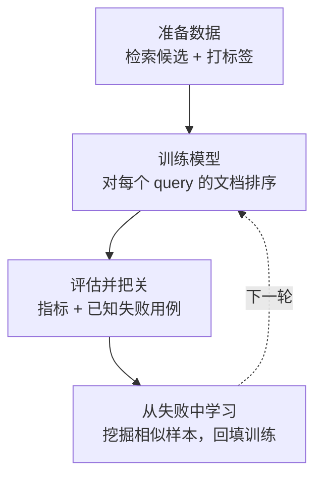

# HeuriBoost

会记住错误的 RAG 重排序。

[English README](./README.md)

你的 RAG 系统在回答一个个人理财问题时，引用了一段“场景错位”的文档。

这不一定是召回完全失败。retriever 可能已经找到了正确证据，但同时也找到了
一个语义很像的 hard negative —— 金融主题相同，但实体/情境错误 —— 并且把这段
误导性文档排得太高。generator 看到的是“看起来很相关、但不能支撑答案”的证据。

HeuriBoost 把这种失败转成一次 reranking 升级：

```text
query: "Can I deduct home-office expenses as a sole proprietor?"

dense retrieval:
  #1 fiqa_doc_corporate_office_lease   hard negative：主题对，实体错
  #2 fiqa_doc_standard_deduction       证据弱/无关
  #3 fiqa_doc_home_office_deduction    直接证据

HeuriBoost rerank:
  #1 fiqa_doc_home_office_deduction    直接证据
  #2 fiqa_doc_simplified_method        部分证据
  #4 fiqa_doc_corporate_office_lease   被记住的 hard negative
```

它还会把这个错误写成 regression gate，确保下一版 reranker 不能再把这段
误导性文档放进受保护的 top-k。

## 概念

HeuriBoost 是一个**自适应 XGBoost 框架**，从带标签样本和历史失败中学习。
本仓库当前交付的是 RAG query-document reranking 的特化（Q-D reranker）；同一
架构可推广到分类、回归等监督表格任务（见 `docs/specs/`）。

核心理念是**失败驱动循环**：系统不只是训练一个模型——它记住哪些失败已修复、
哪些仍开放、是哪个特征或参数改动关闭了它们。已修复的失败固化为 gate；未修复
的失败成为下一轮的攻击目标。

核心抽象（定义见 `docs/specs/ADAPTIVE_XGBOOST_HEURISTIC_SPEC.md`）：

- **TaskProfile** —— 绑定任务类型（ranking/classification/regression…）与其
  objective、指标、gate、slice、serving 行为。Q-D reranker 是其中一个 task
  profile。
- **LearningExample** —— 一条监督样本。ranking 下同组行共享 `group_id`
  （`query_id`）；分类/回归下每行通常是独立实体。
- **PredictionContextSnapshot** —— 模型评估所依据的不可变候选集/特征上下文。
  比较模型必须在同一 snapshot 上进行。
- **RegressionCase** —— 历史失败，以 gate 形式表达（按任务语义描述期望行为）。
  是 gate，不是训练数据。
- **FeatureRecipe** —— 声明式、带版本的 feature，含输入、cost tier、online
  safety、leakage risk、expected slices。feature 住在 registry 里，不散落代码中。
- **PromotionGate** —— 候选模型替换当前模型前必须通过的多维门槛（全局指标、
  per-case、slice、latency、reliability）。
- **FeatureMemory** —— 记录哪些 feature 被 promote/reject/quarantine 及原因的
  机构记忆。

两条铁律绝对成立：

1. **评估快照固定、split 严格隔离** —— train/validation/regression/test 之间
   不得以会泄漏的方式共享行。
2. **Regression case 是考题，不是训练数据** —— 用 case 训练会把它变成橡皮
   图章，破坏"记住错误"的保证。沉淀进训练永远走"抽象/挖掘的样本"，不是 case 行。

## 项目全流程

HeuriBoost 分为四个互相衔接的阶段。前三个阶段把数据变成一个经过评估的模型；
第四个阶段从模型自己犯的错误中学习，把改进回填进去，从而闭环。各阶段的职责在
图下方说明。



### 各阶段职责

- **准备数据** —— 数据构建器跑检索（FiQA 不自带候选），给每个
  query-document 对打上相关性标签（快速启发式，或 LLM 评判）。产出含固定
  train / validation / test 划分的 CSV。
- **训练模型** —— 每一行被转成特征（检索分数与排名，加上 query-document
  文本信号），训练一个 XGBoost 排序模型，并按 query 分组使同一 query 的候选
  始终在一起。
- **评估并记忆** —— 模型与原始检索器基线、以及一份已知失败用例清单对比。
  晋级门禁做两类检查：逐用例检查（这个具体失败修好了吗？）和整体质量检查
  （模型有没有在别处变差？）。每次运行都追加进轮次历史。
- **从失败中学习** —— 对仍在观察名单上的失败，系统从语料里挖掘相似样本并加入
  训练（这些挖掘样本刻意与已知失败用例隔离开）。当一个被观察的失败稳定修好后，
  人工把它晋级为阻断用例，让后续每一轮都不能再退化它。不断重复就是"攻击失败集"
  循环。

### 单轮概念伪代码

```text
function run_round(dataset, failure_cases, history, learn_from_failures):
    # 准备数据 + 训练
    train_rows = load_examples(dataset, split="train")
    if learn_from_failures:
        for case in failure_cases where case 在观察名单上:
            similar = mine_similar_failures(case, corpus)
            similar = keep_separate_from(similar, failure_cases)
        train_rows += load_mined_samples()
        assert_no_overlap(train_rows, failure_cases)   # 安全复检
    model = train_xgb_ranker(train_rows, validation_rows)

    # 评估 + 门禁
    metrics = evaluate(model, split)
    case_results = run_failure_cases(model, failure_cases)
        # 阻断用例失败即终止运行；观察用例只报告
    history.record(round, metrics, case_results, learn_from_failures)
    if history.has_baseline:
        report_overall_quality(metrics 对比 history.baseline)   # 报告，不自动阻断

    # 从失败中学习
    for case in watched_cases_that_now_pass(case_results):
        suggest_promote(case)                          # 手动，永不自动

    # demo 绿灯当且仅当所有阻断用例通过
    return exit_code == 0 iff 没有阻断用例失败
```

两条铁律在每一阶段、每一轮都成立：(1) 已知失败用例的行永不进训练——只有与这些
用例隔离开的挖掘样本才能进；(2) 把观察用例晋级为阻断用例永远是人工决定。

## V0 能做什么

- 校验标准 query-document CSV 契约。
- 按 `query_id` 分组训练真实 XGBoost ranking model。
- 使用固定 V0 特征集：retriever rank/score 和 query-document 文本信号——
  term overlap、number overlap、entity overlap、important-term overlap、
  low-information-density flag 和长度特征。
- 评估 nDCG、MRR、Recall、hard-negative exposure。
- 输出 ranking diff、feature importance、regression gate 结果和轻量失败分析。
- 以 Codex-compatible skill + 本地可运行脚本的方式交付。

## V0 不做什么

V0 不会：

- 替代一阶段 retriever
- 自动标注你的数据
- 强依赖 LangChain、LlamaIndex 或向量数据库
- 运行线上 A/B test
- 提供稳定 Python package 或 public API
- 自动发现、消融、提升或记忆新特征
- 变成通用 AutoML 平台

`failure_analysis.md` 是确定性的轻量分析，不是自动特征挖掘。它只汇总
regression case 元数据、排序变化、期望证据命中情况和 V0 特征对比。

## 目录结构

```text
.
├── README.md
├── README.zh-CN.md
├── CODEBUDDY.md
├── docs/
│   └── specs/
│       ├── ADAPTIVE_XGBOOST_HEURISTIC_SPEC.md
│       ├── ADAPTIVE_XGBOOST_HEURISTIC_SPEC_CN.html
│       ├── QD_RERANKER_SPEC.md
│       └── QD_RERANKER_SPEC_CN.html
├── examples/
│   └── fiqa/
│       ├── query_doc_examples.csv
│       ├── regression_cases.yaml
│       ├── case_sets/
│       │   ├── manifest.json
│       │   └── <case_id>.csv
│       └── DATA_CARD.md
└── skills/
    └── heuriboost-rag/
        ├── SKILL.md
        ├── requirements.txt
        ├── requirements-build.txt
        ├── scripts/
        │   ├── common.py
        │   ├── inspect_rag_repo.py
        │   ├── validate_dataset.py
        │   ├── train_reranker.py
        │   ├── eval_reranker.py
        │   ├── regression_ledger.py
        │   ├── mine_case_sets.py
        │   └── build_fiqa_csv.py
        └── templates/
            ├── query_doc_examples.csv
            ├── regression_cases.yaml
            ├── feature_recipes.yaml
            └── promotion_gate.yaml
```

V0 没有 `pyproject.toml`，请直接运行 skill 目录里的脚本。

## 快速开始

安装依赖：

```bash
python -m pip install -r skills/heuriboost-rag/requirements.txt
```

macOS 上如果 `xgboost` 无法加载 OpenMP，安装 `libomp`：

```bash
brew install libomp
```

校验 demo 数据：

```bash
python3 skills/heuriboost-rag/scripts/validate_dataset.py examples/fiqa/query_doc_examples.csv
```

训练 reranker：

```bash
python3 skills/heuriboost-rag/scripts/train_reranker.py examples/fiqa/query_doc_examples.csv --output-dir examples/fiqa/output
```

评估并运行 regression gate：

```bash
python3 skills/heuriboost-rag/scripts/eval_reranker.py examples/fiqa/query_doc_examples.csv --output-dir examples/fiqa/output --regression-cases examples/fiqa/regression_cases.yaml
```

预期输出：

```text
examples/fiqa/output/
├── models/
│   ├── reranker.json
│   └── reranker_metadata.json
├── reports/
│   ├── eval_report.md
│   ├── ranking_diff.csv
│   ├── failure_cases.md
│   ├── failure_analysis.md
│   ├── failure_analysis.json
│   └── feature_importance.json
└── regression_cases.yaml
```

生成的 `output/` 目录会被 git 忽略。

## 重新生成 demo 数据集

提交进仓库的 `examples/fiqa/query_doc_examples.csv` 是由
`skills/heuriboost-rag/scripts/build_fiqa_csv.py` 从 BEIR/FiQA-2018 离线生成的。
脚本先跑 BM25 + `all-MiniLM-L6-v2` + RRF 检索（FiQA 不自带候选），再用两种模式
之一打标签。

启发式模式 —— 零成本、确定性、无需 LLM（仓库里的 CSV 就是这样生成的）：

```bash
python -m pip install -r skills/heuriboost-rag/requirements-build.txt
python skills/heuriboost-rag/scripts/build_fiqa_csv.py \
  --label-mode heuristic --output examples/fiqa/query_doc_examples.csv
```

LLM 模式 —— 通过 OpenAI 兼容的 judge 打完整 5 级标签（默认 DeepSeek）：

```bash
python -m pip install -r skills/heuriboost-rag/requirements-build.txt
export DEEPSEEK_API_KEY=sk-...   # 或用 OPENAI_API_KEY 并加 --base-url ""
python skills/heuriboost-rag/scripts/build_fiqa_csv.py \
  --label-mode llm --output examples/fiqa/query_doc_examples.csv
```

两种模式都需要联网（下载 FiQA）；只有 LLM 模式需要 API key。该步骤由维护者在本地
运行，不在 CI 中执行。其重依赖、下载的 FiQA 语料以及 dense encoder 权重都不会提交
进仓库。数据来源记录见 `examples/fiqa/DATA_CARD.md`。

## CSV 契约

必需列：

```csv
query_id,query_text,doc_id,doc_text,label,split
```

推荐 V0 列：

```csv
query_id,query_text,doc_id,chunk_id,doc_text,dense_rank,dense_score,sparse_rank,sparse_score,label,split
```

标签含义：

```text
3  能直接支撑答案
2  能部分支撑答案
1  主题相关但证据弱
0  无关
-1 误导性 hard negative
```

训练 XGBoost 时会映射为非负有序相关度：

```text
-1 -> 0
 0 -> 1
 1 -> 2
 2 -> 3
 3 -> 4
```

评估报告会保留原始标签，所以 hard negative 仍然能在报告和 regression gate
中被识别。

## Regression Cases

Regression case 是 gate，不是训练样本。

```yaml
cases:
  - case_id: fiqa_expense_deduction_wrong_topic
    query_id: fiqa_q_001
    query: "Can I deduct home-office expenses as a sole proprietor?"
    must_include_doc_ids:
      - fiqa_doc_home_office_deduction
    must_not_include_doc_ids:
      - fiqa_doc_corporate_office_lease
    top_k: 3
    failure_type: semantic_hard_negative
    expected_evidence:
      - "home office"
      - "deduction"
      - "sole proprietor"
```

如果 required doc 掉出 top-k，或者 forbidden doc 进入 top-k，
`eval_reranker.py` 会让 regression gate 失败。

## 闭环：case_sets 挖掘

Pending case 是已知待攻击的 gap。攻击它的"教科书路径"是：从语料中挖掘
同模式训练样本，折叠进 train，再评估看 pending case 是否趋向通过。Case 本身
仍然是考题——只有 B+C 隔离的挖掘样本进入训练。

四步闭环（由维护者手动运行，不自动 promote）：

```bash
# 1. 为所有 pending case 挖掘同模式样本（需要 build 依赖）
python skills/heuriboost-rag/scripts/mine_case_sets.py \
  --dataset examples/fiqa/query_doc_examples.csv \
  --cases examples/fiqa/regression_cases.yaml \
  --out-dir examples/fiqa/case_sets

# 2. 把挖掘样本折叠进 train 重新训练
python skills/heuriboost-rag/scripts/train_reranker.py \
  examples/fiqa/query_doc_examples.csv \
  --output-dir examples/fiqa/output \
  --case-sets examples/fiqa/case_sets \
  --regression-cases examples/fiqa/regression_cases.yaml

# 3. 评估 + 记账（标记该轮使用了 case_sets）
python skills/heuriboost-rag/scripts/eval_reranker.py \
  examples/fiqa/query_doc_examples.csv \
  --output-dir examples/fiqa/output \
  --split validation \
  --regression-cases examples/fiqa/regression_cases.yaml \
  --case-sets-used

# 4. （手动）如果 pending case 通过且 B 检查 OK，手动 promote
python skills/heuriboost-rag/scripts/regression_ledger.py promote \
  examples/fiqa/regression_cases.yaml <case_id> --ledger examples/fiqa/ledger.json
```

挖掘规则 = a+b+c 交集：与 case query 的语义相似度（all-MiniLM-L6-v2，top-K）、
相同失败形状（hard negative 在 `dense_rank <= --shape-rank`，positive 在
`dense_rank >= --shape-pos-gap`）、相同 `failure_type`。B+C 隔离：挖掘样本的
`query_id` 不能等于任何 case 的 `query_id`，`doc_id` 不能等于任何 case 的
`must_include`/`must_not_include` doc_id。

`sentence-transformers` 是 build 依赖（`requirements-build.txt`），不是运行时
依赖。挖掘时会复用 `examples/fiqa/.cache/query_embeddings.npz`。

> **流水线验证说明**：在启发式标签下，step-2 攻击结果是流水线验证级别，不是
> benchmark。它验证的是闭环机制是否工作（挖掘 → 训练 → 评估 → promote），而非
> 攻击是否真正让 pending case 通过。可信的攻击质量需要 LLM 模式标签
>（`build_fiqa_csv.py --label-mode llm`）。

## 报告说明

`eval_report.md`
: 全局指标和 regression gate 状态。

`ranking_diff.csv`
: 排序前后变化，默认用 dense rank 作为 baseline。

`failure_cases.md`
: top 3 的 hard-negative exposure 报告。

`failure_analysis.md`
: 确定性的 regression-case 分析，包括原因摘要、排序变化、证据命中、特征对比和下一步建议。

`feature_importance.json`
: 基于 XGBoost gain 的特征重要性，并按 V0 特征列表归一化输出。

## Agent Skill

Codex-compatible skill 位于：

```text
skills/heuriboost-rag/SKILL.md
```

它有三种模式：

- `audit`：扫描 RAG 仓库中的 retriever/eval/log/dataset 信号
- `bootstrap`：复制模板并解释 CSV 契约
- `experiment`：校验 CSV、训练、评估并查看报告

其他 coding agent 仍然可以手动运行 Python 脚本，但 V0 不提供完整多 agent
安装体验。

## 当前状态

状态：V0 prototype。

demo 使用了 BEIR/FiQA-2018（金融问答）的真实切片：一段金融主题相同、但
实体/情境错误的文档和 query 语义相近，却不能支撑答案。HeuriBoost 会把真正
能支撑答案的文档排上来，并把这段误导性的 hard negative 压下去。提交进仓库的
CSV 是离线生成的（见“重新生成 demo 数据集”和 `examples/fiqa/DATA_CARD.md`）。

在该 demo（230 条 query，150/40/40 划分）上，reranker 在冷 test holdout 上
依然泛化良好：nDCG@10 0.83，对比 dense 0.35 / sparse 0.25 / RRF 0.32；top-3
hard negative 暴露从 dense 的 2.15 降到 0.48。validation 与 test 接近
（nDCG@10 0.85 vs 0.83），说明提升不是单纯记忆。这些数字基于启发式标签
（qrel 正例 + 基于 dense 排名的 hard negative），用于演示循环而非作为
benchmark；需要 benchmark 级标签请用 `--label-mode llm`。

长文设计规格位于 `docs/specs/`。
